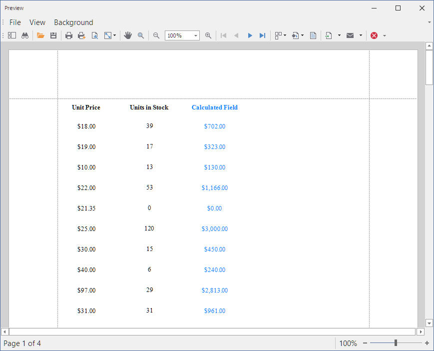

# How to Create a Calculated Field at Runtime

This example creates a calculated field at runtime and binds it to the label's Text property.

## Files to Review:

* [Form1.cs](./CS/UsingCalculatedFields/Form1.cs) (VB: [Form1.vb](./VB/UsingCalculatedFields/Form1.vb))

## Documentation:

- [Calculated Fields](https://docs.devexpress.com/XtraReports/4813/detailed-guide-to-devexpress-reporting/shape-report-data/use-calculated-fields/calculated-fields-overview)